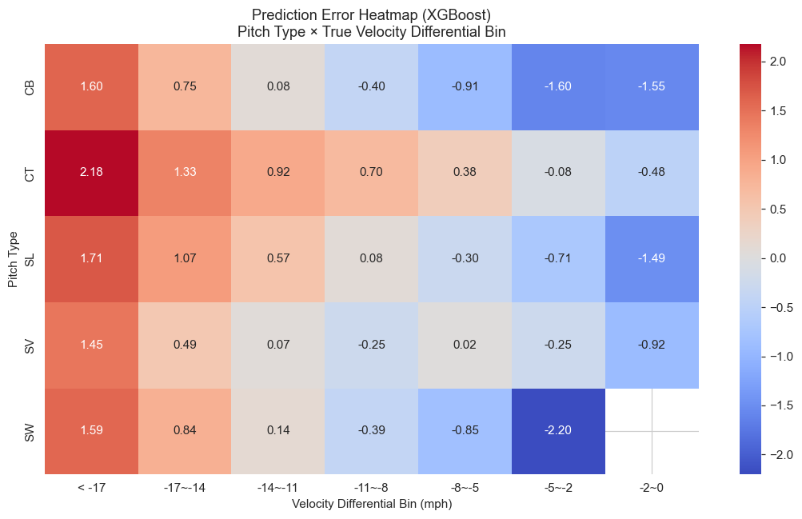

# MLB Pitch Velocity Gap Prediction Model

## Project Overview

This project aims to predict the **velocity differential (velocity gap)** between a pitcher's primary fastball and their breaking pitches — including **cutters, sliders, sweepers, slurves, and curveballs** — using pitch-level Statcast data from the 2020–2024 MLB regular seasons.

The target variable is defined as the **difference in velocity** between each breaking pitch and the pitcher’s average fastball velocity during the same season. For example, if a pitcher averages 95 MPH on fastballs and throws a curveball at 78 MPH, the velocity gap is -17 MPH.

## Objective

Build a model to predict this **velocity gap** based on available pitch characteristics, pitcher attributes, and contextual features. The goal is to uncover what factors contribute most to the speed differences between fastballs and breaking pitches, which may inform pitch design, scouting, or player development strategy.

## Table of Contents
1. [Data Preprocessing & Feature Engineering](#1-data-preprocessing--feature-engineering)  
2. [Exploratory Data Analysis (EDA)](#2-exploratory-data-analysis-eda)  
3. [Modeling Approach & Validation](#3-modeling-approach--validation)  
4. [Model Interpretation](#4-model-interpretation)  
5. [Conclusion & Next Steps](#5-conclusion--next-steps)  

---

## 1. Data Preprocessing & Feature Engineering

**Objective:** Assemble a clean, pitch-level dataset with domain-informed features to predict  
\`velocity_diff\` = (breaking-ball velocity) – (primary fastball velocity).

### 1.1 Load & Inspect Raw Data
- **Rows**: 3,108,206 pitches (2020–2024).  
- **Features**: 36 columns including pitch characteristics and post-contact outcomes.  
- **Missingness**: Significant gaps in exit-velo, launch_angle, spray_angle, hit_spin_rate; minor gaps in spin_rate, extension, break_x/z.

### 1.2 Drop Irrelevant & Essential-Only Columns
- **Removed** post-contact columns:  
  \`exit_velo\`, \`launch_angle\`, \`spray_angle\`, \`hit_spin_rate\`.  
- **Filtered** out any row lacking \`release_velo\` → **3,107,690** rows remain.

### 1.3 Hierarchical Imputation
- **Primary**: fill missing \`spin_rate\`, \`break_x\`, \`extension\`, etc., by pitcher-season-pitch_type mean.  
- **Fallback**: league-wide pitch_type mean.  
- **Result**: zero missing values.

### 1.4 Plausibility Filters
- **Count logic**: balls ≤ 3, strikes ≤ 2, \`tto\` ∈ [1,6], pitch_num ∈ [1,20].  
- **Physical ranges**:  
  - 45–106 mph for \`release_velo\`  
  - ±50 inches for \`break_x/z\`  
  - 4.5–8 ft for \`extension\`  
  - Valid release and location bounds  
- **Dropped** 9.5% of rows → **2,811,370** remain.

### 1.5 Handedness Normalization
- Mirror horizontal metrics for LHPs (\`release_x\`, \`break_x\`, \`location_x\`, \`haa\`, \`hra\`) → new columns with \`_adj\` suffix.

### 1.6 Primary Fastball Identification
1. Filter FF & SI pitches.  
2. Count per pitcher-season → select most frequent as \`primary_fastball\`.  
3. Compute each pitcher-season’s average fastball velocity → \`primary_fastball_velo\`.  
4. Retain only pitcher-seasons with ≥ 30 primary fastballs → drop 536 groups.

### 1.7 Breaking-Ball Subset & Target Creation
- Keep only CT/SL/SW/SV/CB → **898,038** rows after merging primary FB.  
- velocity_diff = release_velo - primary_fastball_velo

### 1.8 Rare-Pitch-Type Filter

* Require ≥ 10 pitches of each breaking-ball type per pitcher-season → drop 3,722 rows → **894,316** remain.

### 1.9 Differential Feature Engineering

* For each fastball baseline feature (release, spin, break, angles, location):

  1. Compute pitcher-season average from FF/SI → prefix \`fb\_\`.
  2. Compute delta:
     \`<feature>*diff = breaking*<feature> – fb\_<feature>\`.
* **Derived features**:

  * \`total\_movement\_diff = √(break\_x\_diff² + induced\_break\_z\_diff²)\`
  * \`spin\_efficiency = |induced\_break\_z| / spin\_rate\`
  * \`movement\_angle = arctan2(break\_x\_adj, break\_z)\`

### 1.10 Final Feature Set

* **Context:** \`pitch\_type\`, \`throws\`, count vars, inning info
* **Raw metrics:** spin, break, release, extension, angles, location
* **Diff metrics:** release\_*, spin\_*, break\_*, angles\_*, location\_\*
* **Domain-derived:** spin\_efficiency, movement\_angle
* **Dropped** identifiers & post-contact fields.

> **Train set**: 894,316 rows × 41 cols → saved as CSV/Parquet.

---

## 2. Exploratory Data Analysis (EDA)

**Objective:** Validate feature behavior, detect leakage, and surface domain insights.

### 2.1 Feature Distributions

* Summary (`describe`) confirms plausible ranges;
* \`spin\_efficiency\` is **right-skewed**, may require transformation in future.

### 2.2 Leakage Check

* Pearson ρ of every numeric feature vs \`velocity\_diff\`:

  * Top positive: `break_z` (0.80), `induced_break_z` (0.62), `break_x_adj` (0.54)
  * Strong negative: `total_movement_diff` (–0.71), because it is a magnitude-based feature (squared deltas), where large values imply greater overall deviation and typically slower pitches.
  * Context vars (balls, inning) show near-zero correlation → **no leakage**.

### 2.3 Spearman Correlation Matrix

* Confirms monotonic relationships; no severe multicollinearity.

### 2.4 Velocity Gap by Pitch Type

| pitch\_type | count   | mean   | median | std  |
| ----------- | ------- | ------ | ------ | ---- |
| CB          | 78,036  | –11.76 | –11.80 | 2.35 |
| SW          | 115,054 | –11.50 | –11.46 | 2.19 |
| SV          | 8,247   | –10.79 | –11.13 | 2.49 |
| SL          | 477,313 | –8.74  | –8.70  | 2.60 |
| CT          | 215,666 | –4.24  | –4.11  | 2.48 |

### 2.5 Movement vs Gap

* **Horizontal break** vs gap

* **Induced vertical break** vs gap

### 2.6 Positive-Gap Sanity Check

* **7,528** cases where `velocity_diff > 0`

  * CT: 7,480 (expected)
  * SL: 48 (rare classification noise)
* **Decision:** Given that only **Slider** has rare positive `velocity_diff` instances — likely due to pitch classification overlap, pitch-to-pitch variation, or edge cases in defining the pitcher's fastball baseline — we **do not drop these rows**.

### 2.7 Extension & Spin Efficiency Trends

* **Extension diff** shows **U-shaped LOWESS** trend → minimizing gap when extension ≈ fastball.
  
* **Spin efficiency** LOWESS → higher efficiency → smaller gap.
  

---

## 3. Modeling Approach & Validation

**Objective:** Compare linear vs. non-linear models with pitcher-aware splits.

### 3.1 Data Split

1. **Holdout**: 2024 pitches from **unseen** pitchers (149 pitchers, 28,996 rows).
2. **Training**: 2020–2023 + 2024 of seen pitchers (1,161 pitchers, 865,320 rows).

### 3.2 Cross-Validation

* **GroupKFold (5-fold)** by `pitcher_id` → prevents intra-pitcher leakage.

### 3.3 Preprocessing Pipeline

* **Numeric**: StandardScaler
* **Categorical**: OneHotEncoding of `pitch_type`

### 3.4 Models & Tuning

| Model             | Hyperparameters                | Notes                  |
| ----------------- | ------------------------------ | ---------------------- |
| Linear Regression | –                              | Baseline               |
| Ridge Regression  | α ∈ {0.1, 1.0, 10.0}           | L2 regularization      |
| Lasso Regression  | α ∈ {0.001, 0.01, 0.1}         | L1 + feature selection |
| XGBoost           | fixed (1000 trees, lr=0.05, …) | manual tuning, no grid |
| LightGBM          | fixed (1000 trees, lr=0.05, …) | manual tuning, no grid |

### 3.5 Evaluation Metrics

* **CV**: MAE, RMSE, R² (averaged across folds)
* **Holdout**: MAE, RMSE, R²

| Model            | CV MAE | CV RMSE | CV R² | Holdout MAE | Holdout RMSE | Holdout R² |
| ---------------- | ------ | ------- | ----- | ----------- | ------------ | ---------- |
| LinearRegression | 0.302  | 0.425   | 0.986 | 0.310       | 0.507        | 0.980      |
| Ridge            | 0.302  | 0.425   | 0.986 | 0.310       | 0.506        | 0.980      |
| Lasso            | 0.476  | 0.615   | 0.970 | 0.492       | 0.688        | 0.963      |
| XGBoost          | 0.985  | 1.258   | 0.875 | 0.902       | 1.195        | 0.889      |
| LightGBM         | 1.002  | 1.278   | 0.871 | 0.913       | 1.208        | 0.886      |

---

## 4. Model Interpretation

### 4.1 Top Ridge Coefficients

All of the coefficient magnitudes and signs align with domain expectations—features that intuitively increase the perceived gap (e.g. more horizontal separation) have negative coefficients (gap becomes more negative), and those that reduce the gap have positive ones.

| Feature                     | Coefficient | Effect                                                       |
| --------------------------- | ----------: | ------------------------------------------------------------ |
| **haa\_adj**                |      –57.91 | haa\_adj ↑ → velocity\_diff ↓ (gap increases)                |
| **break\_x\_diff**          |      –55.13 | break\_x\_diff ↑ → velocity\_diff ↓ (gap increases)          |
| **haa\_diff**               |      +54.10 | haa\_diff ↑ → velocity\_diff ↑ (gap decreases)               |
| **break\_x\_adj**           |      +41.85 | break\_x\_adj ↑ → velocity\_diff ↑ (gap decreases)           |
| **hra\_adj**                |      +41.06 | hra\_adj ↑ → velocity\_diff ↑ (gap decreases)                |
| **hra\_diff**               |      –39.89 | hra\_diff ↑ → velocity\_diff ↓ (gap increases)               |
| **vaa**                     |      –31.52 | vaa ↑ → velocity\_diff ↓ (gap increases)                     |
| **break\_z**                |      +22.80 | break\_z ↑ → velocity\_diff ↑ (gap decreases)                |
| **vaa\_diff**               |      +19.70 | vaa\_diff ↑ → velocity\_diff ↑ (gap decreases)               |
| **location\_z\_diff**       |      –13.54 | location\_z\_diff ↑ → velocity\_diff ↓ (gap increases)       |
| **vra**                     |      +13.05 | vra ↑ → velocity\_diff ↑ (gap decreases)                     |
| **location\_z**             |      +12.28 | location\_z ↑ → velocity\_diff ↑ (gap decreases)             |
| **induced\_break\_z\_diff** |       –8.96 | induced\_break\_z\_diff ↑ → velocity\_diff ↓ (gap increases) |
| ...                         |         ... | ...                                                          |

- **Horizontal Approach Angle (HAA) & Break X**  
  The most influential features are `haa_adj`, `haa_diff`, and `break_x_diff`, all related to the **horizontal movement and entry angle** of the pitch. (Since haa_diff = breaking_ball_haa_adj – fastball_haa_adj is typically negative, a positive coefficient implies that when the horizontal approach angle becomes more similar to the fastball.)
  
  ➤ This confirms that pitchers who generate more **horizontal separation** from their fastballs (e.g., big sweepers) tend to create larger perceived velocity differentials — a well-known pitch design goal.

### 4.2 SHAP Summary (XGBoost)

This SHAP summary plot visualizes the **global feature importance** in the trained XGBoost model.

* Top drivers: `vaa_diff`, `break_z`, `location_z_diff`. These features suggest that **vertical components of pitch shape and location** are key drivers of predicted velocity differential in XGBoost.

* While Ridge Regression emphasized **horizontal movement features** like `haa_diff`, `break_x_diff`, and `break_x_adj`, XGBoost gives more weight to **vertical movement and release-based factors**.

* This difference arises because:

    - **Ridge assumes linear relationships** and captures strong additive signals (like consistent horizontal separation).
    - **XGBoost captures non-linear and interaction effects**, which may explain why it surfaces vertical factors that interact with other features (e.g., vertical drop varying with release point).

### 4.3 Error Heatmaps

To better understand how model prediction errors vary across pitch types and true velocity differential bins, we use the **entire dataset (2020–2024, including both training and holdout pitchers)** to generate detailed heatmaps.

* **Ridge vs XGBoost** across pitch types & true gap bins
  
  

* **XGBoost**: Overestimates slower cutters/sliders and underestimates faster curveballs/sweepers, showing more erratic errors.
* **Ridge Regression**: Delivers smaller, more balanced errors across pitch types, with consistently better calibration. → **preferred** for deployment.

---

## 5. Conclusion & Next Steps

### 5.1 Final Conclusion

After evaluating five models using both pitcher-aware cross-validation (GroupKFold) and a strict holdout set composed of **unseen 2024 pitchers**, we conclude that:

1. **Best Model: Ridge Regression**

   * **Holdout performance:** MAE ≈ 0.31 mph, R² ≈ 0.98.
   * Outperformed more complex models like XGBoost and LightGBM (MAE > 0.9), despite their non-linear learning capabilities.
   * Demonstrated **stable error behavior** across pitch types and velocity bands.
   * Provides interpretable coefficients that align with established pitching mechanics (e.g., horizontal break, approach angle, tunneling principles).

2. **Why Ridge Wins**

   * Its strong performance stems from **robust domain-driven feature engineering**, particularly:

     * Differential metrics like `break_x_diff`, `haa_diff`, `vaa_diff`, `location_z_diff`, etc.
     * Engineered features such as `total_movement_diff`, `spin_efficiency`, and `movement_angle`.
   * These features **linearize** many of the complex physical relationships governing pitch deception, making them ideal for **regularized linear models** like Ridge.
   * As a result, Ridge captures essential signal without needing complex tree-based models, while remaining transparent and easy to explain to coaches and analysts.

3. **Key Feature Patterns**

   * Top predictors emphasize **differences in horizontal and vertical movement** compared to the pitcher’s fastball.
   * **Approach and release angles**, as well as **location separation**, are also crucial drivers of perceived velocity gap.

> Ultimately, Ridge strikes the best balance between predictive accuracy, interpretability, and generalizability to new pitchers — making it the most **trustworthy model for deployment** in real-world MLB analytics workflows.

### 5.2 Next Steps

* **Deploy Ridge Regression** with current preprocessing pipeline on live Statcast data.
* **Feature Enhancements**

  * Consider interaction terms or polynomial features (e.g., `release_x_diff × spin_rate_diff`) if complexity budget increases.
* **Model Ensemble**

  * Blend Ridge predictions with XGBoost to potentially improve robustness on edge cases.
* **Temporal Drift Monitoring**

  * Re-evaluate performance on incoming 2025+ pitch data to detect changes in pitch usage or model degradation.
* **Visualization Toolkit**

  * Develop dashboards highlighting model predictions, error bands, and pitch-specific insights for coaching staff.

### References
[1] Driveline Baseball. (2021). *Optimizing Breaking Ball Shape Through Data-Driven Pitch Design (Part One)*. Retrieved from: [https://www.drivelinebaseball.com/2021/09/optimizing-breaking-ball-shape-through-data-driven-pitch-design-part-one/](https://www.drivelinebaseball.com/2021/09/optimizing-breaking-ball-shape-through-data-driven-pitch-design-part-one/)
